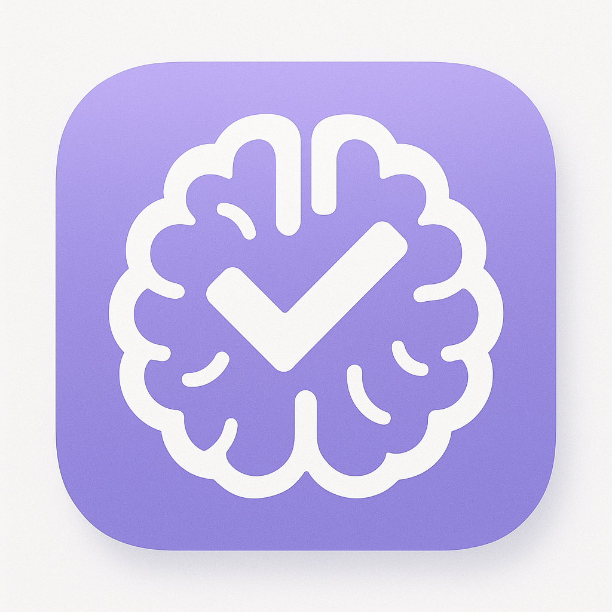

# 🔒 LockIN - Ultimate Productivity Hub

<div align="center">



**Stay focused, stay productive**

[](https://reactnative.dev/)
[](https://expo.dev/)
[](LICENSE)
[](CONTRIBUTING.md)

_The all-in-one productivity app designed for developers, students, and professionals who want to maximize their potential_

[🚀 Features](#-features) • [📱 Screenshots](#-screenshots) • [⚡ Quick Start](#-quick-start) • [🛠️ Tech Stack](#️-tech-stack) • [📖 Documentation](#-documentation)

</div>

---

## 🌟 Overview

LockIN is a comprehensive productivity application built with React Native and Expo, designed specifically for developers and tech enthusiasts. It combines project management, coding practice, learning resources, and personal development tools into one seamless experience.

### 🎯 Why LockIN?

- **🔥 All-in-One Solution**: Project tracking, coding practice, learning resources, and productivity tools
- **📊 Progress Analytics**: Detailed statistics and progress tracking across all activities
- **🌙 Modern UI/UX**: Beautiful dark/light theme with smooth animations and intuitive design
- **💾 Offline Support**: Local data storage with sync capabilities
- **⚡ Performance First**: Optimized for speed and smooth user experience
- **🎨 Customizable**: Personalized experience with theme preferences and custom workflows

---

## 🚀 Features

### 🏠 **Dashboard & Overview**

#### **Intelligent Home Screen**

- **📈 Real-time Progress Analytics**: Visual overview of all your activities
- **⚡ Quick Actions**: Fast access to frequently used features
- **🎯 Daily Goals**: Personalized daily challenges and targets
- **📊 Statistics Grid**: Comprehensive progress tracking across all modules
- **🌅 Time-based Greetings**: Personalized welcome messages
- **💡 Motivational Quotes**: Gen-Z style motivational content to keep you engaged

#### **Smart Metrics**

- Project completion rates
- Video learning progress
- Coding problem solving stats
- Roadmap advancement tracking
- Daily streak counters
- Achievement badges

---

### 📁 **Project Management**

#### **Advanced Project Tracker**

- **📝 Project Creation**: Detailed project setup with descriptions, categories, and timelines
- **✅ Task Management**: Granular task breakdown with subtasks and dependencies
- **📊 Progress Visualization**: Real-time progress bars and completion percentages
- **🏷️ Smart Categorization**: Organize projects by type, priority, and status
- **📅 Timeline Tracking**: Start dates, deadlines, and milestone management
- **📈 Analytics Dashboard**: Project performance metrics and insights

#### **Task Features**

- **✨ Drag & Drop Interface**: Intuitive task organization
- **🔔 Smart Notifications**: Deadline reminders and progress alerts
- **📝 Rich Text Notes**: Detailed descriptions with formatting support
- **🔗 Link Attachments**: Connect external resources and documentation
- **⏱️ Time Tracking**: Built-in timer for task duration monitoring
- **🎯 Priority Levels**: High, medium, low priority classification

---

### 🎓 **Learning Management System**

#### **Video Learning Hub**

- **📺 Course Organization**: Structured video playlists and series
- **⏯️ Playback Control**: Advanced video player with speed controls
- **📑 Note Taking**: Synchronized notes with video timestamps
- **🔖 Bookmarks**: Quick access to important video sections
- **📊 Progress Tracking**: Completion percentages and watch time analytics
- **🎯 Learning Paths**: Curated educational journeys

#### **Learning Analytics**

- **📈 Progress Reports**: Detailed learning statistics
- **⏱️ Time Investment**: Track study hours and patterns
- **🎯 Goal Setting**: Personal learning objectives
- **📋 Completion Certificates**: Achievement recognition system

---

### 💻 **Coding Practice Platform**

#### **NeetCode 150 Integration**

- **🧩 Essential Problems**: Curated collection of 150 must-know coding problems
- **📊 Difficulty Tracking**: Easy, Medium, Hard problem categorization
- **✅ Progress Monitoring**: Real-time solving progress with visual indicators
- **🏆 Achievement System**: Unlock badges and milestones
- **📈 Performance Analytics**: Success rates and improvement tracking
- **🎯 Daily Goals**: Personalized coding challenges

#### **Competitive Programming Tracker**

- **🏟️ Platform Integration**: Support for multiple coding platforms
- **📊 Contest Tracking**: Monitor competitive programming performance
- **📈 Rating Analytics**: Track rating changes and improvements
- **🎯 Problem Sets**: Organized practice problems by topics
- **⏰ Time Management**: Contest preparation and scheduling tools

#### **Daily Coding Challenges**

- **⚡ Fresh Problems Daily**: New challenges every day
- **🎮 Gamification**: Points, streaks, and leaderboards
- **💡 Hint System**: Progressive hints for learning
- **🔍 Solution Analysis**: Detailed explanations and multiple approaches
- **📊 Performance Metrics**: Speed and accuracy tracking

---

### 🗺️ **Learning Roadmaps**

#### **Structured Learning Paths**

- **🛣️ Career Roadmaps**: Frontend, Backend, DevOps, Data Science paths
- **📚 Step-by-Step Guidance**: Structured learning progression
- **✅ Milestone Tracking**: Clear checkpoints and achievements
- **📖 Resource Integration**: Links to tutorials, documentation, and courses
- **🎯 Skill Assessment**: Regular progress evaluations
- **🔄 Adaptive Learning**: Personalized recommendations based on progress

#### **Custom Roadmap Creation**

- **🎨 Visual Builder**: Drag-and-drop roadmap designer
- **📝 Rich Content**: Add descriptions, resources, and prerequisites
- **👥 Community Sharing**: Share roadmaps with other users
- **📊 Analytics**: Track community engagement and effectiveness

---

### 📚 **Code Reference Library (CheatSheets)**

#### **Quick Reference System**

- **📋 Code Snippets**: Organized collection of reusable code
- **🏷️ Smart Categorization**: Algorithms, Data Structures, Languages, Frameworks
- **🔍 Advanced Search**: Find snippets by keywords, tags, or categories
- **📝 Rich Editor**: Syntax highlighting and formatting tools
- **💾 Cloud Sync**: Access your snippets anywhere
- **📤 Export Options**: Share snippets in multiple formats

#### **Snippet Management**

- **✨ Modern Editor**: Syntax highlighting with multiple language support
- **🎨 Theme Support**: Dark/light mode code highlighting
- **📋 Quick Copy**: One-click copying with formatting preservation
- **🔗 Smart Linking**: Connect snippets to projects and problems
- **📊 Usage Analytics**: Track most-used snippets and patterns
- **🔄 Version Control**: Track changes and revisions

#### **Categories Available**

- **🧮 Algorithms**: Sorting, searching, optimization algorithms
- **🏗️ Data Structures**: Arrays, trees, graphs, hash tables
- **🔤 String Manipulation**: Pattern matching, parsing, formatting
- **🎯 Dynamic Programming**: Memoization patterns and optimization
- **🌐 Web Development**: Frontend and backend code snippets
- **📱 Mobile Development**: React Native and platform-specific code
- **🛠️ DevOps**: Configuration files, scripts, and automation
- **🧪 Testing**: Unit tests, integration tests, and testing utilities

---

### 🎨 **User Experience & Design**

#### **Modern Interface Design**

- **🌙 Dark/Light Themes**: Automatic system detection with manual override
- **🎨 Gradient Aesthetics**: Beautiful linear gradients throughout the app
- **✨ Smooth Animations**: Fluid transitions and micro-interactions
- **📱 Mobile-First Design**: Optimized for all screen sizes
- **♿ Accessibility Support**: Screen reader friendly with proper contrast ratios
- **🎯 Intuitive Navigation**: Bottom tab navigation with contextual screens

#### **Performance Optimizations**

- **⚡ Fast Loading**: Optimized bundle size and lazy loading
- **💾 Efficient Storage**: Local data persistence with AsyncStorage
- **🔄 Smart Caching**: Intelligent cache management for better performance
- **📱 Native Feel**: Platform-specific UI elements and behaviors

---

### 🔧 **Technical Features**

#### **Data Management**

- **💾 Local Storage**: Robust local data persistence
- **🔄 Data Sync**: Seamless synchronization across devices
- **📊 Analytics Engine**: Built-in progress tracking and reporting
- **🔐 Data Security**: Encrypted local storage for sensitive information
- **📤 Export/Import**: Backup and restore functionality

#### **Notification System**

- **🔔 Smart Reminders**: Context-aware notifications
- **⏰ Custom Scheduling**: Personalized notification timing
- **🎯 Progress Alerts**: Achievement and milestone notifications
- **📱 Cross-Platform**: Native notification support for iOS and Android

---

## 📱 Screenshots

<div align="center">

### 🏠 Home Dashboard

 

_Beautiful overview with progress analytics and quick actions_

### 📁 Project Management

 

_Comprehensive project tracking with task management_

### 💻 Coding Practice

 

_Integrated coding practice with progress tracking_

### 📚 Learning Resources

 

_Structured learning paths and video management_

### 📋 Code References

 

_Quick reference library with advanced search_

</div>

---

## ⚡ Quick Start

### 📋 Prerequisites

- **Node.js** (v18 or higher)
- **npm** or **yarn**
- **Expo CLI** (for development)
- **Git** (for version control)

### 🚀 Installation

1. **Clone the Repository**

   ```bash
   git clone https://github.com/Siyam-Bhuiyan/LockIN.git
   cd LockIN
   ```

2. **Install Dependencies**

   ```bash
   npm install
   # or
   yarn install
   ```

3. **Start Development Server**

   ```bash
   npx expo start
   # or
   npm start
   ```

4. **Run on Device/Simulator**
   - **📱 Mobile**: Scan QR code with Expo Go app
   - **🤖 Android**: Press `a` to open Android simulator
   - **🍎 iOS**: Press `i` to open iOS simulator
   - **🌐 Web**: Press `w` to open in browser

### 🔧 Development Setup

```bash
# Install Expo CLI globally
npm install -g @expo/cli

# Start with cleared cache
npx expo start --clear

# Run with specific port
npx expo start --port 8081

# Development build
npx expo run:android
npx expo run:ios
```

---

## 🛠️ Tech Stack

### 📱 **Frontend Framework**

- **React Native 0.79.5**: Cross-platform mobile development
- **Expo 53.0.0**: Development platform and tools
- **React 19.0.0**: UI library with hooks and modern patterns

### 🧭 **Navigation & UI**

- **React Navigation 6.x**: Native navigation solution
  - Bottom Tab Navigator
  - Stack Navigator
  - Screen transitions and animations
- **React Native Screens**: Native screen optimization
- **React Native Safe Area Context**: Safe area handling

### 🎨 **Design & Styling**

- **Expo Linear Gradient**: Beautiful gradient effects
- **React Native Vector Icons**: Comprehensive icon library
- **Custom Theme System**: Dark/light mode support
- **Styled Components**: Dynamic styling with theme integration

### 💾 **State & Storage**

- **React Hooks**: Modern state management with useState, useEffect, useContext
- **AsyncStorage**: Local data persistence
- **Context API**: Global state management for themes and user preferences

### 📱 **Platform Features**

- **Expo Status Bar**: Status bar customization
- **Expo Splash Screen**: Native splash screen integration
- **Expo Notifications**: Push notification support
- **React Native Modal**: Advanced modal components

### 🔧 **Development Tools**

- **Metro Bundler**: JavaScript bundling and hot reloading
- **Expo Dev Tools**: Debugging and development utilities
- **ESLint**: Code quality and consistency
- **Prettier**: Code formatting

---

## 📂 Project Structure

```
LockIN/
├── 📱 App.js                 # Main app component with navigation
├── 🎯 app.json              # Expo configuration
├── 📦 package.json          # Dependencies and scripts
├──
├── 📁 assets/               # Static assets
│   ├── 🖼️ images/
│   ├── 🔤 fonts/
│   └── 🎨 icons/
│
├── 🧩 components/           # Reusable UI components
│   ├── 📋 ui/              # Generic UI components
│   │   ├── Button.js
│   │   ├── Card.js
│   │   ├── ProgressBar.js
│   │   └── ThemeToggle.js
│   ├── ProjectCard.js
│   ├── ProjectModal.js
│   ├── TaskItem.js
│   ├── TaskModal.js
│   ├── VideoItem.js
│   └── ProblemItem.js
│
├── 🎨 context/             # React Context providers
│   └── ThemeContext.js     # Theme management
│
├── 📊 data/                # Static data and configurations
│   └── neetcodeProblems.js # Coding problems dataset
│
├── 📱 screens/             # Main application screens
│   ├── HomeScreen.js       # Dashboard and overview
│   ├── ProjectsScreen.js   # Project management
│   ├── LearningScreen.js   # Video learning hub
│   ├── RoadmapScreen.js    # Learning roadmaps
│   ├── CPTrackerScreen.js  # Competitive programming
│   ├── NeetCodeScreen.js   # Coding practice
│   ├── DailyChallengeScreen.js # Daily challenges
│   ├── CheatSheetsScreen.js # Code reference library
│   ├── ProblemDetailScreen.js # Problem details
│   └── SplashScreen.js     # App loading screen
│
├── ⚙️ services/            # Business logic and data services
│   └── StorageService.js   # Local storage management
│
└── 🔧 utils/               # Utility functions
    └── notifications.js    # Notification helpers
```

---

## 📖 Documentation

### 🔧 **Configuration**

#### **Theme Customization**

```javascript
// context/ThemeContext.js
export const themes = {
  light: {
    primary: "#6366f1",
    secondary: "#8b5cf6",
    background: "#f8fafc",
    surface: "#ffffff",
    // ... more theme properties
  },
  dark: {
    primary: "#818cf8",
    secondary: "#a78bfa",
    background: "#0f172a",
    surface: "#1e293b",
    // ... more theme properties
  },
};
```

#### **Adding New Screens**

```javascript
// 1. Create screen component
const NewScreen = ({ navigation }) => {
  const { theme } = useTheme();
  // Screen implementation
};

// 2. Add to navigation
import NewScreen from "./screens/NewScreen";

// 3. Add to tab navigator
<Tab.Screen name="NewScreen" component={NewScreen} />;
```

#### **Storage Service Usage**

```javascript
import StorageService from "../services/StorageService";

// Save data
await StorageService.saveProjects(projects);

// Load data
const projects = await StorageService.getProjects();

// Clear data
await StorageService.clearAllData();
```

### 🎯 **API Reference**

#### **StorageService Methods**

- `getProjects()` - Retrieve all projects
- `saveProjects(projects)` - Save projects array
- `getVideos()` - Retrieve video learning progress
- `saveVideos(videos)` - Save video data
- `getProblems()` - Get coding problems
- `saveProblems(problems)` - Save problem progress
- `getRoadmaps()` - Get learning roadmaps
- `saveRoadmaps(roadmaps)` - Save roadmap data
- `getCheatSheets()` - Get code snippets
- `saveCheatSheets(sheets)` - Save snippet library
- `getNeetCodeProgress()` - Get NeetCode 150 progress
- `saveNeetCodeProgress(progress)` - Save coding progress
- `clearAllData()` - Reset all app data

#### **Theme Context API**

```javascript
const { theme, isDark, toggleTheme } = useTheme();

// Theme properties
theme.primary; // Primary color
theme.secondary; // Secondary color
theme.background; // Background color
theme.surface; // Surface color
theme.text; // Primary text color
theme.textSecondary; // Secondary text color
theme.border; // Border color
theme.success; // Success color
theme.warning; // Warning color
theme.error; // Error color

// Theme methods
toggleTheme(); // Switch between light/dark
```

---

## 🚀 Advanced Features

### 🔔 **Notifications**

```javascript
import { scheduleNotification } from "../utils/notifications";

// Schedule daily reminder
await scheduleNotification({
  title: "Daily Coding Challenge",
  body: "Ready for today's problem?",
  trigger: { hour: 9, minute: 0, repeats: true },
});
```

### 📊 **Analytics Tracking**

```javascript
// Track user progress
const analytics = {
  projectsCompleted: stats.completedProjects,
  videosWatched: stats.watchedVideos,
  problemsSolved: stats.solvedProblems,
  studyStreak: calculateStreak(),
};
```

### 🎨 **Custom Components**

```javascript
// Create reusable progress cards
<StatCard
  title="Projects"
  value={completed}
  total={total}
  color={theme.primary}
  icon="folder-outline"
  onPress={() => navigation.navigate("Projects")}
/>
```

---

## 🤝 Contributing

We welcome contributions from the community! Here's how you can help:

### 🔧 **Development Workflow**

1. **Fork the Repository**

   ```bash
   git fork https://github.com/Siyam-Bhuiyan/LockIN.git
   ```

2. **Create Feature Branch**

   ```bash
   git checkout -b feature/amazing-feature
   ```

3. **Make Changes**

   - Follow existing code style and patterns
   - Add proper documentation
   - Write tests for new features

4. **Commit Changes**

   ```bash
   git commit -m "✨ Add amazing feature"
   ```

5. **Push to Branch**

   ```bash
   git push origin feature/amazing-feature
   ```

6. **Create Pull Request**
   - Provide detailed description
   - Include screenshots for UI changes
   - Reference related issues

### 📋 **Contribution Guidelines**

- **🎯 Focus Areas**: UI/UX improvements, new features, performance optimization
- **📝 Code Style**: Follow existing patterns and ESLint configuration
- **🧪 Testing**: Add tests for new functionality
- **📚 Documentation**: Update README and inline documentation
- **🐛 Bug Reports**: Use issue templates with detailed reproduction steps

### 🎨 **Design Contributions**

- **🖼️ Screenshots**: High-quality app screenshots
- **🎨 Icons**: Custom icons and illustrations
- **🌈 Themes**: New color schemes and themes
- **📱 UI Components**: Reusable component designs

---

## 🐛 Troubleshooting

### 🔧 **Common Issues**

#### **Metro Bundler Issues**

```bash
# Clear cache and restart
npx expo start --clear

# Reset Metro cache
npx expo start --reset-cache
```

#### **Android Build Issues**

```bash
# Clean and rebuild
cd android
./gradlew clean
cd ..
npx expo run:android
```

#### **iOS Build Issues**

```bash
# Clean iOS build
cd ios
xcodebuild clean
cd ..
npx expo run:ios
```

#### **Package Installation Issues**

```bash
# Clear npm cache
npm cache clean --force

# Delete node_modules and reinstall
rm -rf node_modules package-lock.json
npm install
```

### 📱 **Platform-Specific Issues**

#### **Android**

- **Permissions**: Ensure notification permissions are granted
- **Storage**: Check available storage space
- **RAM**: Close other apps to free memory

#### **iOS**

- **Certificates**: Verify development certificates
- **Simulator**: Use latest iOS simulator version
- **Permissions**: Grant necessary app permissions

---

## 📄 License

This project is licensed under the MIT License - see the [LICENSE](LICENSE) file for details.

### 🎯 **MIT License Summary**

- ✅ Commercial use allowed
- ✅ Modification allowed
- ✅ Distribution allowed
- ✅ Private use allowed
- ❌ Liability protection
- ❌ Warranty protection

---

## 🙏 Acknowledgments

### 🌟 **Inspiration & Resources**

- **NeetCode**: For the comprehensive coding problem dataset
- **React Native Community**: For amazing open-source components
- **Expo Team**: For the excellent development platform
- **Design Inspiration**: Modern mobile app design patterns

### 🎨 **Design Credits**

- **Icons**: Ionicons by Ionic Framework
- **Gradients**: Inspired by modern design trends
- **Typography**: System fonts optimized for readability
- **Color Schemes**: Carefully crafted for accessibility

### 🚀 **Special Thanks**

- Contributors who helped improve the app
- Beta testers who provided valuable feedback
- Open-source community for inspiration and tools

---

## 📞 Support & Contact

### 💬 **Get Help**

- **📖 Documentation**: Check this README and inline documentation
- **🐛 Bug Reports**: [GitHub Issues](https://github.com/Siyam-Bhuiyan/LockIN/issues)
- **💡 Feature Requests**: [GitHub Discussions](https://github.com/Siyam-Bhuiyan/LockIN/discussions)
- **📧 Email**: [your-email@example.com](mailto:your-email@example.com)

### 🌐 **Links**

- **🏠 Homepage**: [Project Website](https://your-website.com)
- **📚 Documentation**: [Full Documentation](https://docs.your-website.com)
- **🎥 Demo Video**: [YouTube Demo](https://youtube.com/watch?v=demo)
- **📱 Download**: [App Store](#) | [Google Play](#)

---

<div align="center">

**Built By Bhuiyan**

_Made for developers, by developers_

[](https://github.com/Siyam-Bhuiyan/LockIN)
[](https://github.com/Siyam-Bhuiyan/LockIN/fork)
[](https://github.com/Siyam-Bhuiyan/LockIN)

</div>
